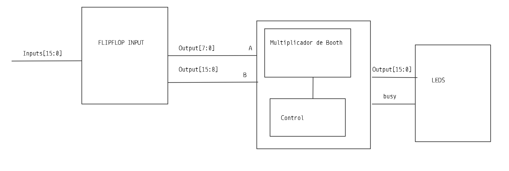
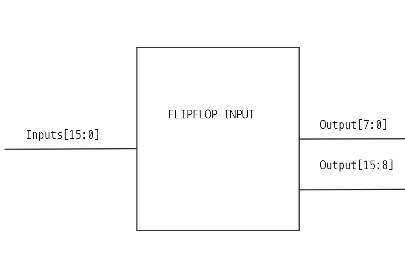
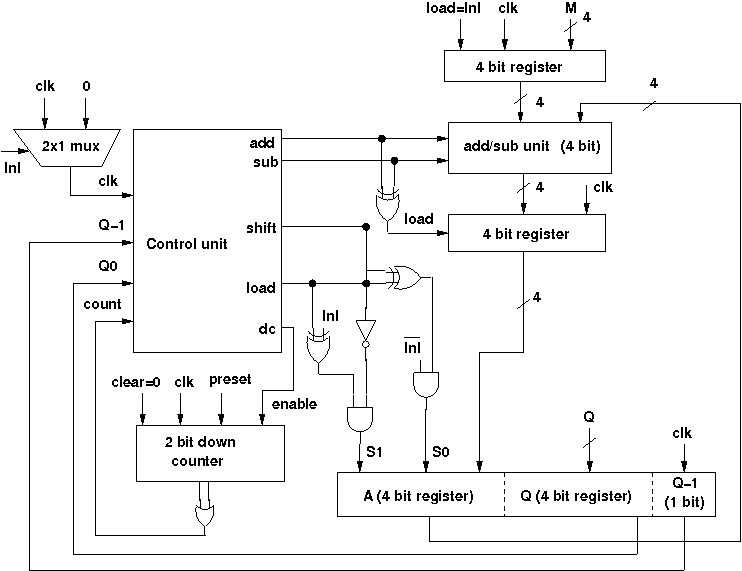
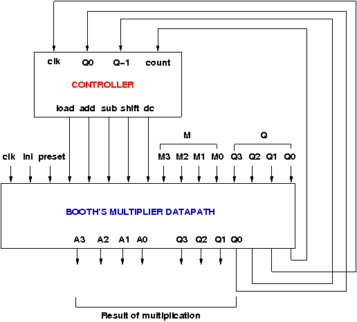
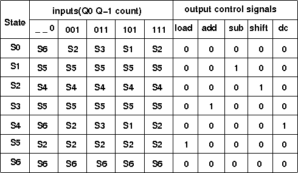
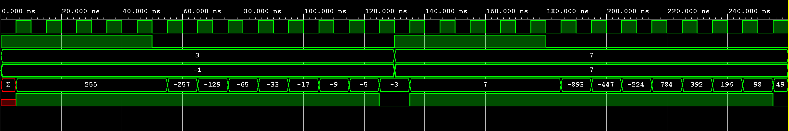

# Booth Algorithm for 8 bits SystemVerilog

Este proyecto implementa el algoritmo de Booth para 8 bits con complemento a 2 en System Verilog. Se utiliza una Basys 3 para recibir el los numeros en los switches y los leds para el resultado del numero.

## Una descripción general del funcionamiento del circuito completo y de cada subsistema.

El proyecto se compone 3 grandes sistemas la entrada de los flip-flop, el multiplicador booth y leds.

- Flipflop: son los encargados de recibir la info desde el exterior. La salida se divide en dos para que el multiplicador de capaz de recibir los datos.

- Multiplicador: aparte del reset que no se pone porque es redudante, este recibe los bits de salida de los flipflops que de 7 a 0 son A el multiplicando y 15 a 0 es B el multiplicador. Este tiene de salida el resultado que es Output[15:0] y busy que es una variable que indica si el algoritmo aun se encuentra calculando.

- Leds: es un sistema que se encarga de recibir los datos que se quieren mostrar en los LEDS.

## Diagramas de bloques de cada subsistema y su funcionamiento fundamental

### FlipFlop

Es que recibe las entradas.

### Multiplicador de Booth 

El multiplicador esta representado con el siguiente diagrama.

### Control

El control esta dado por el siguiente diagrama.

## Diagramas de estado de todas las FSM diseñadas (si existen).

La FSM que diseno tiene la siguiente tabla.

## Ejemplo y análisis de una simulación funcional del sistema completo, desde el estímulo de entrada

Se realizo un testbench para probar el algoritmo

## Análisis de consumo de recursos en la FPGA (LUTs, FFs, etc.) y del consumo de potencia

Segun vivado esto reporta:

## Reporte de velocidades máximas de reloj posibles en el diseño (mínima frecuencia de reloj para este
diseño: 50 MHz).

## Análisis de principales problemas hallados durante el trabajo y de las soluciones aplicadas.

El mayor problema que se tuvo fue el sistemas de LEDS ya que el numero como pude tomar valores desde -32,768 hasta 32,767 no pude mostrar los todos los valores al mismo tiempo ya que solamente se cuenta con 4 displays. Por esta parte fue el mayor del proyecto 